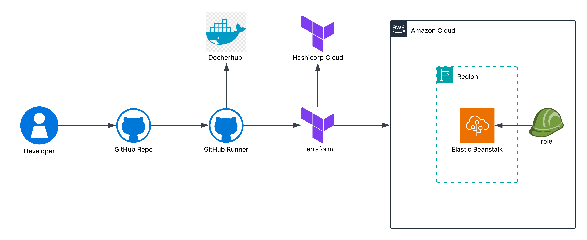

# Weather App with Terraform Deployment

A simple web API built with Python and Flask that provides weather-related information, deployed to AWS Elastic Beanstalk using Terraform.

## Project Overview

This project consists of:
- A Python Flask application that serves weather data via API endpoints
- Terraform infrastructure as code to deploy the app to AWS Elastic Beanstalk
- Hashicorp cloud platform to store Terraform state file
- GitHub Actions CI/CD pipeline for automated testing and deployment
- Docker containerization for consistent deployment

## API Endpoints

- `GET /` - Homepage
- `GET /api/v1.0/weather?location=<location>` - Get complete weather data
- `GET /api/v1.0/temperature?location=<location>` - Get temperature data
- `GET /api/v1.0/wind?location=<location>` - Get wind data
- `GET /api/v1.0/humidity?location=<location>` - Get humidity data

## Prerequisites

- Python 3.9+
- Docker
- Dockerhub account
- Terraform
- Hashicorp cloud platform account
- AWS account with appropriate permissions
- GitHub account

## CI/CD Pipeline

The GitHub Actions workflow performs the following steps:
- Linting: Runs Ruff linter on Python code
- Unit Testing: Runs pytest across multiple OS and Python versions
- Docker Build: Builds and pushes Docker image to Docker Hub
- Container Testing: Runs tests inside the built Docker container
- Terraform Deployment: Deploys infrastructure to AWS
- Endpoint Testing: Tests all API endpoints after deployment
- Clean-up: Optionally destroys resources after testing

## Environment Variables

Required environment variables for deployment:
- AWS_ACCESS_KEY_ID
- AWS_SECRET_ACCESS_KEY
- TF_TOKEN_app_terraform_io (Hashicorpt Cloud API token)
- DOCKER_USERNAME
- DOCKER_PASSWORD

These should be set as GitHub Secrets in your repository settings.

## Testing

The CI pipeline includes comprehensive testing across:
- Multiple operating systems (Ubuntu, macOS, Windows)
- Multiple Python versions (3.9-3.13)
- Both host and container environments

## License

This project is licensed under the terms of the MIT License. See [LICENSE](./LICENSE) for more details.

## Contributing

Contributions are welcome! Please open an issue or submit a pull request.
